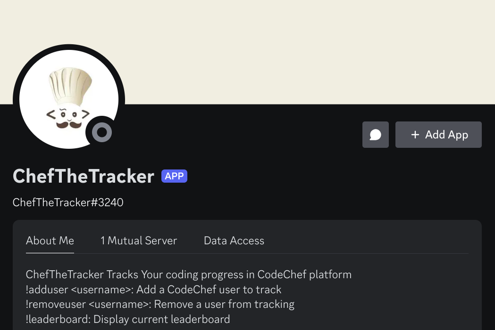
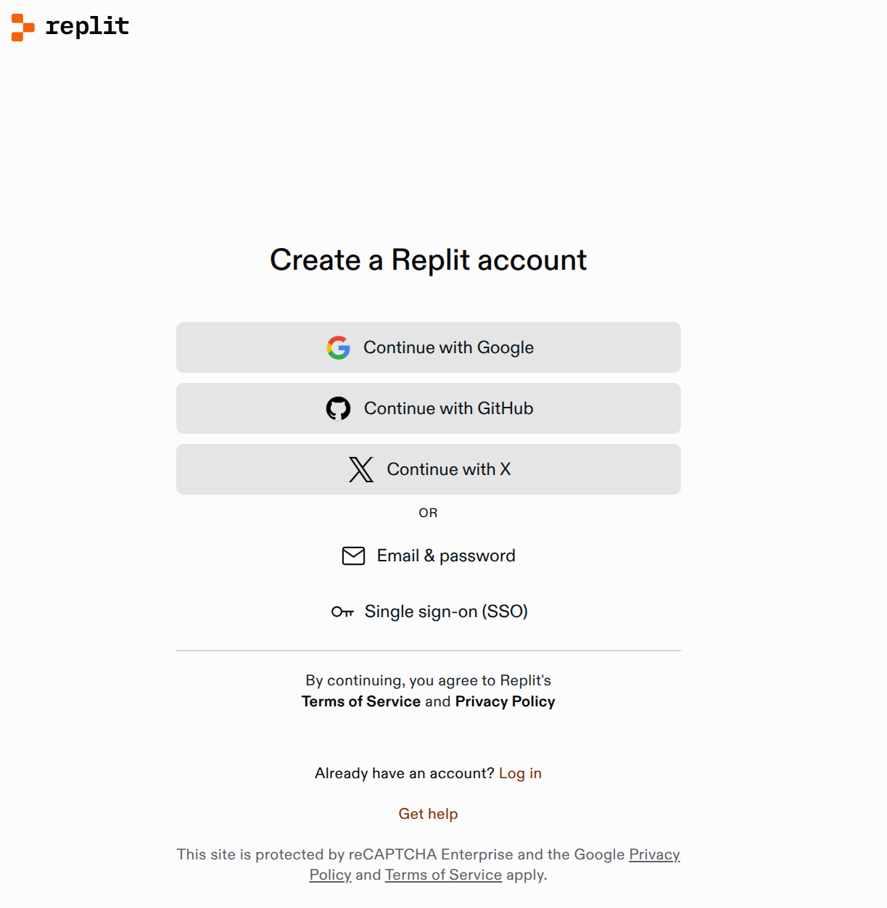

# ChefTheTracker

ChefTheTracker is a Discord bot for your discord server which helps you to compete with your friends in problems and boost your competitive spirit 

## STEPS FOR INSTALLATION :
### I WILL JUST SAY HOW YOU HAVE TO START THE BOT USING THE GIVEN CODE IN MY REPO -->
## ***STEP 1 :*** 
***CREATE AN ACCOUNT IN REPLIT WHICH IS FREE TO USE ***

## ***STEP 2 :*** 

---

## Additional Components: AnswerQuiz Project

This repository also includes camera-based quiz application components with OpenCV integration.

### Features
- Camera color fixing functionality
- OpenCV integration for image processing
- Multiple camera handling scripts

### Files
- `opencv_color_fix.py` - OpenCV-based color correction
- `simple_camera_fix.py` - Simple camera fixes
- `final_camera_color_fix.ps1` - PowerShell script for final processing

### Installation
1. Install Python dependencies
2. Ensure OpenCV is properly configured
3. Run the appropriate script for your needs

### Usage
Run the Python scripts to apply camera color corrections.

## Contributing
Feel free to contribute improvements and bug fixes!

## Recent Updates
- Added comprehensive camera color fixing functionality
- Integrated OpenCV solutions for camera issues
- Enhanced project documentation

## License
Open source - feel free to use and modify.
